# Writing Release Notes

## Requirements

- **Version**: a tag like `v0.2.0`. Ask if missing. Accept with or without leading `v`; emit canonical `v` form in output.

## Workflow

```dot
digraph release_notes {
    entry [shape=doublecircle, label="Version?"];
    fetch_tags [shape=box, label="List tags +\ncheck target"];
    prev_exists [shape=diamond, label="Previous tag\nexists?"];
    first_release [shape=box, label="Range =\ninitial-commit..HEAD\n(note in summary)"];
    target_exists [shape=diamond, label="Target tag\nexists?"];
    range_tag [shape=box, label="Range =\nprev..target"];
    ask_head [shape=box, label="AskUser:\nconfirm HEAD"];
    range_head [shape=box, label="Range =\nprev..HEAD"];
    locate_changelog [shape=box, label="Locate CHANGELOG\nentry for version"];
    list_commits [shape=box, label="List commits\nin range"];
    cross_check [shape=box, label="Cross-check\ncommits vs CHANGELOG"];
    changelog_present [shape=diamond, label="CHANGELOG\nentry exists?"];
    use_changelog [shape=box, label="Sections =\nCHANGELOG sections"];
    derive_sections [shape=box, label="Derive sections\nfrom commit prefixes"];
    filter [shape=box, label="Filter"];
    breaking [shape=diamond, label="Breaking?"];
    flag_break [shape=box, label="Require Breaking\nChanges section"];
    title [shape=box, label="Generate title"];
    draft [shape=box, label="Draft notes"];
    antislop [shape=box, label="Anti-slop pass"];
    clean [shape=diamond, label="Clean?"];
    present [shape=doublecircle, label="Present output"];

    entry -> fetch_tags;
    fetch_tags -> prev_exists;
    prev_exists -> first_release [label="no"];
    prev_exists -> target_exists [label="yes"];
    target_exists -> range_tag [label="yes"];
    target_exists -> ask_head [label="no"];
    ask_head -> range_head;
    first_release -> locate_changelog;
    range_tag -> locate_changelog;
    range_head -> locate_changelog;
    locate_changelog -> list_commits;
    list_commits -> cross_check;
    cross_check -> changelog_present;
    changelog_present -> use_changelog [label="yes"];
    changelog_present -> derive_sections [label="no"];
    use_changelog -> filter;
    derive_sections -> filter;
    filter -> breaking;
    breaking -> flag_break [label="yes"];
    breaking -> title [label="no"];
    flag_break -> title;
    title -> draft;
    draft -> antislop;
    antislop -> clean;
    clean -> antislop [label="no, rewrite"];
    clean -> present [label="yes"];
}
```



### Resolve version range

Run in parallel:

```bash
# Sorted tags, newest first
git tag --sort=-v:refname

# Whether the target tag exists locally
git rev-parse "refs/tags/<version>" 2>/dev/null || echo TAG_NOT_FOUND
```

If `git tag` is empty, run `git fetch --tags` and re-list before continuing.

From the sorted tag list, pick the tag immediately before `<version>`.

- Target tag exists, previous tag exists: range is `<prev>..<version>`.
- Target tag does not exist, previous tag exists: range is `<prev>..HEAD`. `AskUserQuestion` to confirm `HEAD` is the intended endpoint before proceeding.
- No previous tag (first release): range is `<initial-commit>..HEAD`. Note this in the Summary.

When the range is otherwise ambiguous (two plausible previous tags, unusual tag pattern), confirm with the user before continuing.

### Locate CHANGELOG entry for version

Read `CHANGELOG.md` and find the section for the version, in this priority:

1. `## [<version>] - <date>` (release-prep commit already stamped it).
2. `## [Unreleased]` (release prep in progress; entries staged but not yet stamped).
3. None.

The CHANGELOG entry is the curated source of truth when it exists. Capture its section headers verbatim; commons uses organic sections (`Added`, `Changed`, `Fixed`, `Fail-hard`, `Packaging`, `Documentation`, `CI`, `Dependencies`, `Chore`) rather than a fixed taxonomy, and the release notes must mirror them. If only `[Unreleased]` is present, use its contents but flag in your output that the stamping commit has not landed yet.

### List commits in range

```bash
git log <range> --pretty=format:"%H %s" --no-merges
git diff <range> --stat
```

Commits land directly on `main` and follow conventional-commit prefixes (`feat`, `fix`, `refactor`, `perf`, `build`, `ci`, `docs`, `chore`, `test`, optional `(scope)`, optional `!` for breaking). The submodule scopes for commons are `resolve`, `schema`, `sql`, `vss`. There are no PR numbers in subjects.

For each commit, read the full message body (`git show <sha>`) when the subject alone underdetermines what the commit does or whether it is user-visible.

Every line in the eventual draft must trace to a CHANGELOG bullet, a commit subject, a commit body, or a diff hunk read here. Do not invent change descriptions or migration steps.

### Cross-check commits vs CHANGELOG

If a CHANGELOG entry exists for the version, walk every commit in the range and check that its user-visible effect appears in the CHANGELOG. Mismatch cases:

- **Commit not represented in CHANGELOG**: include the commit's effect under the closest matching section. Flag the gap to the user at the end (the CHANGELOG should be updated to match).
- **CHANGELOG bullet without a commit in the range**: leave it in the notes (the CHANGELOG was hand-curated by the author and may aggregate several commits), but flag any bullet that cannot trace to any commit in the range so the user can verify.

When no CHANGELOG entry exists, all section content comes from commits alone.

### Derive sections (no CHANGELOG entry)

When the CHANGELOG has no entry for this version, map commits to sections using the prefix:

| Commit prefix                           | Section          |
| --------------------------------------- | ---------------- |
| `feat:` / `feat(scope):`                | Added            |
| `fix:` / `fix(scope):`                  | Fixed            |
| `refactor:` / `perf:`                   | Changed          |
| `build:`                                | Packaging        |
| `ci:`                                   | CI               |
| `docs:`                                 | Documentation    |
| `chore:` (non-release)                  | Chore            |
| any with `!` or `BREAKING CHANGE:` body | Breaking Changes |

Promote a Fail-hard subgroup under Added/Changed when a commit introduces a new refusal or raises a previously silent failure (the body usually says "raises ValueError" or "refuses ..."). Drop empty sections.

### Filter

Exclude from the user-facing notes:

- The release-prep commit itself (`chore(release): X.Y.Z`); the version implies it.
- Test-only commits unless the release is test-focused.
- Internal refactors with no observable effect, unless they unblock something the user cares about.
- Dep bumps with no functional change. Roll multiple bumps into a single `Dependencies` line with the count if at least three are present, otherwise omit.

### Detect breaking changes

Mark a change as breaking if any apply:

- Commit message body contains `BREAKING CHANGE:` or subject carries `!` after the type.
- Removed or renamed a public symbol from any submodule (`resolve`, `schema`, `sql`, `vss`). Downstream consumers (the compactor, the merger) import these by name.
- Changed the signature of a public function in a way that breaks existing callers: required parameters added (without a default), required parameters removed or reordered, return type changed, exception contract narrowed (a previously raised exception is no longer raised in the corresponding case) or widened (a new exception class added to a function that previously raised a smaller set).
- Floor pin move in `[project.dependencies]` that moves `duckdb` or `duckdb-extension-vss` outside the previously supported on-disk DuckDB file-format range. Commons owns these floors on behalf of downstream consumers, so the move is breaking even if the API surface is unchanged.
- Changed a refusal in `schema.reject_unsupported_objects` such that a source previously accepted is now refused (or vice versa). The front gate is a contract.
- Removed a submodule, or renamed a submodule (the import path is part of the contract).

If any breaking change is present, the notes must include `### Breaking Changes` with migration guidance.

### Generate title

A descriptive 3-6 word title that captures the release theme.

- Single-focus release: name the main change. Example: `HNSW Metric Recovery`, `Front-Gate Refusal`.
- Multi-feature release: combine themes. Example: `Schema Front Gate & vss Bundling`.

### Draft notes

Use this exact skeleton:

```markdown
## v{version} - {Title}

### Summary

{1-3 sentences. Start with an action verb. Name the user-visible effect for downstream consumers.}

### Changes

#### {Section}

- {Description starting with an action verb. Name the user-visible effect.}

{repeat per section}

### Breaking Changes

{Only if any. Describe what breaks and the migration path. Include code or command examples when they shorten the explanation.}

### Upgrade Notes

{Either concrete upgrade steps, or the literal line: `No breaking changes.`}
```

Format rules:

- Title line is `## v{version} - {Title}`. Becomes the GitHub release title.
- Sections use `####`. Omit a section if it has no entries.
- Section order, when both apply: `Added`, `Changed`, `Fixed`, `Fail-hard`, `Packaging`, `Documentation`, `CI`, `Dependencies`, `Chore`. Within a section, order by user impact: features first, then incremental polish.
- One bullet per change. Match the granularity of the CHANGELOG bullet when one exists; otherwise one bullet per commit, combining only when several commits implement one user-visible change.
- Plain prose bullets. Lead with an action verb (`Add`, `Fix`, `Refactor`, `Reduce`). Do not bold a change name and follow with a colon. The `- **Title**: description.` pattern reads as AI slop.
- No PR or commit citations in bullets. The CHANGELOG does not cite either; the release notes match.
- Code examples for new exports or new keyword arguments belong inline under the relevant bullet.
- Always include the `### Upgrade Notes` section. Use the literal `No breaking changes.` when no migration applies.
- No "Generated with Claude Code" footer. Release notes carry no attribution.

### Anti-slop pass

The release notes are user-facing prose for downstream consumers. Re-read `references/writing-rules-anti-ai-slop.md` and check the draft literally:

1. Search for em dash (—) and en dash (–). Remove every instance.
2. Re-read each word against the banned vocabulary list.
3. Check for banned sentence patterns and hedging filler.
4. Scan for `- **Title**: description.` bullets. Rewrite them as plain prose bullets that lead with an action verb.
5. Vary sentence rhythm. Do not let every bullet be the same length.

Rewrite affected text and re-check. Do not exit this step until the draft passes every check.

### Present

Output:

1. A short header: version, previous tag, commit count in range, and any cross-check gaps flagged above (commits missing from CHANGELOG, or CHANGELOG bullets not traceable to any commit).
2. The release notes inside a fenced markdown block so the user can copy-paste.
3. Offer to copy the notes (without fences) to the system clipboard via the `clipboard-copy` MCP tool (`clipboard_copy`). Ask first.

The session's gh-tooling MCP is read-only. The user pastes the notes into the GitHub Release page themselves; do not attempt to create or edit the release.
